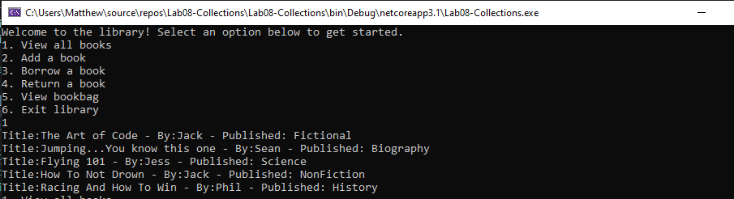
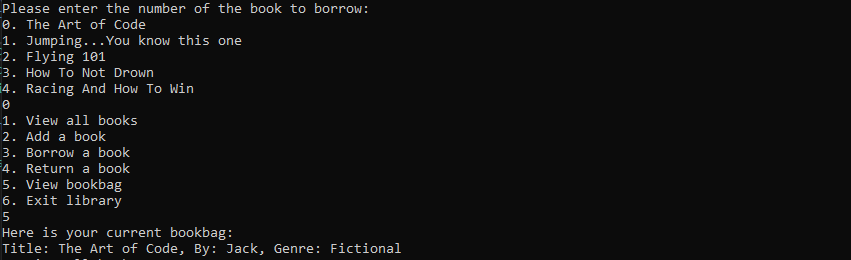

# Lab08-Collections

**Author**: Matthew Petersen
**Version**: 1.0.0 

## Overview
Create and utilize generic collections. Created a library! Users are given multiple choices of ways to interact with the library. This meant creating classes for an Author, Books and the Library. Collections came into play when a user either adds or removes a book from their book bag. Users are also able to create new books, view all the books within the library and the books in their bag!

## Getting Started
Clone the repository down to your local machine with: Git clone clonedRepoHere
Enter VSC and view all of our beautiful tests!
You can hit the green play button, and the code will walk you through how to utilize the library game!

## Example

## Architecture
C# + VSC with some inheritance!

## Change Log

1/20/2021 - Uploaded, all code functional and tests passing.
